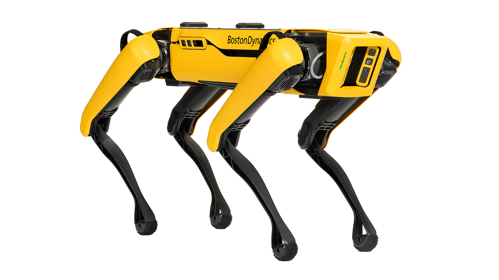

# RustBuster
This is a **ROS2** (Humble) project developed to perform **Autonomous Simultaneous Localization and Mapping** (A-SLAM) using a Spot robot from Boston Dynamics.



<!---## Motivation
Offshore oil platforms are critical infrastructure that must be maintained to ensure their safety and longevity. Regular inspections are required to identify and address any signs of corrosion or other forms of degradation. However, these inspections can be dangerous and time-consuming for human inspectors, making it difficult to perform regular, thorough checks.
RustBuster was created to address this challenge by providing a safe, efficient, and automated solution for inspecting offshore oil platforms. The Spot robot is able to access difficult-to-reach areas and collect data on the condition of the platform, making it possible to perform regular and comprehensive inspections.
to inspect offshore oil platforms for rust and other forms of corrosion.--->

## Hardware
 * Spot robot
 * RealSense Intel D455 (RGB-D and IMU)
 * Laptop
 * Ethernet cable (optional)

The intel d455 is used instead of spot's, native cameras because it has a higher frame rate and IMU.\
**NOTE:** It is possible to calculate Spot's IMU using the odometry messages, but the method is slow and imprecise.

## Installation
This system was developed and tested only in a Lenovo IdeaPad Gaming 3 15ARH05 laptop running **Ubuntu 22.04**. 

Install dependencies from public repositories:
   ```
   sudo apt update
   
   # Boston Dynamics software
   pip3 install bosdyn-client bosdyn-mission bosdyn-api bosdyn-core
   
   # Ros related packages
   sudo apt install -y \
   ros-humble-nav2* \
   ros-humble-imu-filter-madgwick* \
   ros-humble-librealsense2* \
   ros-humble-apriltag* \
   ros-humble-usb-cam*     # (Optional)
   ```
   
Clone repositories into ROS2 workspace:
   ```
   mkdir -p ros2_ws/src && cd ros2_ws/src 
   git clone https://github.com/Hakaino/RustBuster
   git clone https://github.com/bdaiinstitute/spot_ros2.git
   git clone https://github.com/robo-friends/m-explore-ros2
   cd ..
   rosdep install --from-paths src --ignore-src -r -y 
   ```

## Setup Spot
Follow this [Connect Spot](https://support.bostondynamics.com/s/article/Spot-network-setup#ConnecttoSpotviaDirectEthernet)

<details>
<summary>AAU memebers</summary>
<br>
I developed this project as a student at Aalborg University (AAU).
Contact Frank Rasmussen (fhr@es.aau.dk) to get access to a robot.
</details>

## Usage
4. Connect the Spot robot to your computer and turn it on.
5. Launch the RustBuster program by running the following command:\
   ```
   colcon build --symlink-install
   source install/setup.bash
   ros2 launch rustbuster rustbuster_launch.py
   ```
6. The robot will begin performing the inspection routine and collecting data. You can monitor the progress and view the data by using the ROS tools.

## Contributing

If you would like to contribute to the development of RustBuster, please feel free to open a pull request or reach out to us via email. We welcome all contributions, from fixing bugs to adding new features.
## License

RustBuster is open-source software, licensed under the MIT License.